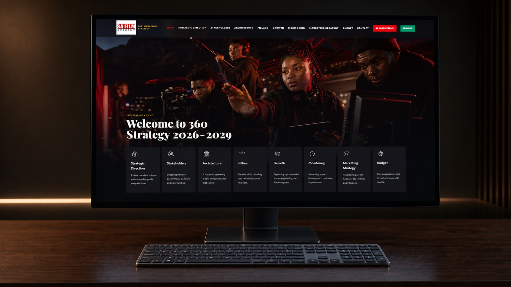

# SAFA ProMax — Public Portfolio Case Study

**Recruiter-facing portfolio evidence** for a creative-technology and full-stack delivery engagement for SA Film Academy.

## Project overview

SAFA ProMax presents a 360° marketing strategy as a navigable digital platform. The experience brings strategic direction, stakeholder framing, systems architecture, production evidence, growth planning and monitoring into one coherent presentation surface.

## The challenge

The work needed to turn a broad stakeholder and marketing brief into a clear decision experience: easy to navigate, visually credible, useful across board and production conversations, and structured for future content updates.

## My role and contribution

- Systems architecture and delivery direction
- Full-stack web implementation across a responsive Next.js and TypeScript platform
- Information architecture for strategy, stakeholders, production evidence and growth
- Creative-technology direction across visual language, navigation and presentation flow
- CMS-oriented content modelling and maintainable media organisation
- Delivery documentation, privacy boundaries and release verification

## Systems and delivery evidence

The public interface demonstrates a structured navigation model, responsive presentation layout, media-led storytelling, content collections, production-credit views and a clear boundary between portfolio evidence and private delivery operations.

The implementation repository remains private. This repository is a curated portfolio case study, not implementation source code.

## Recruiter review

| Review area | Evidence in this case study |
| --- | --- |
| Architecture | Strategy, stakeholder, architecture, growth and monitoring sections are represented as a coherent information system. |
| Full-stack delivery | Responsive interface structure, route-level content organisation and production-ready presentation patterns. |
| Creative technology | Editorial visual direction, film-industry context and a presentation experience designed for real stakeholder use. |
| Governance | Clear public/private boundary, security guidance and non-sensitive evidence only. |
| Delivery judgement | A complex brief is reduced to a navigable, reviewable and maintainable public experience. |

## Live platform

[Open the public SAFA ProMax presentation](https://safa-promax.vercel.app/)

The visual below is a generated recruiter-facing representation of the public presentation surface:

## Portfolio and contact

- [N.White Systems portfolio](https://nwhite.systems)
- [N.White Systems GitHub](https://github.com/whitemorengwira/nwhitesystems)
- [Request a professional walkthrough](mailto:hello@nwhite.systems?subject=SAFA%20ProMax%20portfolio%20walkthrough)

## Public boundary

This repository contains recruiter-facing portfolio evidence only. The implementation repository remains private, and private source, credentials, stakeholder records, internal notes and operational configuration are not part of this public repository.

## Repository contents

- `docs/assets/safa-promax-hero.png` — 1600 × 900 hero interface capture
- `docs/assets/safa-promax-live.png` — 1600 × 900 live public-interface capture
- `docs/assets/social-preview.png` — 1280 × 640 social-preview image
- `docs/` — concise recruiter and verification notes
- `SECURITY.md` and `COPYRIGHT.md` — public-use and reporting boundaries

Copyright © 2026 Whitemore Ngwira. See [COPYRIGHT.md](COPYRIGHT.md).
